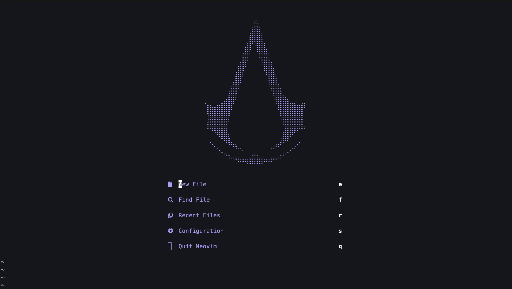

# Configuration



## Tree structure

```bash tree
nvim
├── init.lua
└── lua
    ├── config
    │   └── lazy.lua
    └── plugins
        ├── alpha.lua
        ├── colorizer.lua
        ├── colorscheme.lua
        ├── lsp.lua
        ├── oil.lua
        └── telescope.lua
```

## Explanation

### `lazy.lua` :

> A configuration file that handle lazy plugin management.

### `aplha.lua` :

> Configuration for the Alpha plugin, which provide a dashboard and startup screen.

### `colorizer.lua` :

> Configuration for the Colorizer plugin, which enhances color display in vim buffer.

### `colorscheme.lua` :

> A file dedicated to setting up and managing color schemes for Neovim.

- I use my colorscheme : [mono-purple](https://github.com/debrunbaix/mono-purple.nvim)

### `lsp.lua` :

> Configuration for Language Server Protocol (LSP) integration, enabling advanced language features like autocompletion and diagnostics for `Python` and `C`.

### `oil.lua` :

> Configuration for the Oil plugin, which provide file management in vim buffer.

### `telescope.lua` :

> Configuration for the Telescope plugin, a fuzzy finder for files, buffers, and more.

## Installation

Git clone.

```bash
cd ~/.config
git clone https://github.com/debrunbaix/nvim.git
```

Install the lsp server.

```bash
sudo pacman -S clang pyright
```

Test the config.

```bash
nvim
```

## Shortcut

| Shortcut | Action         |
| -------- | -------------- |
| space, o | Open Oil       |
| space, f | Open Telescope |

